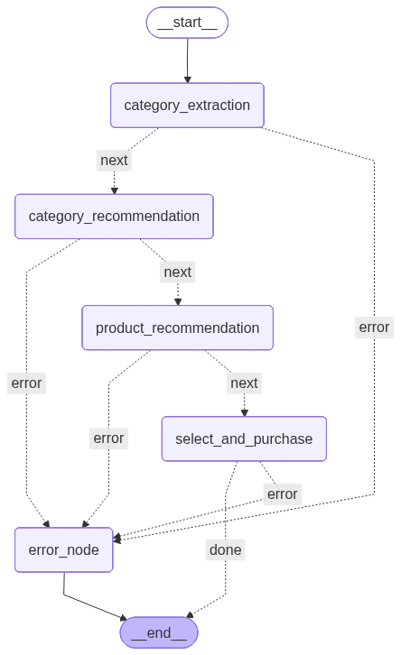

# 🛍️ Shopping Assistant Agent — Intelligent Product Recommendation System


test video : https://www.youtube.com/watch?v=h-xiRJ0mqFA
This project implements an **AI-driven conversational shopping assistant** using **LangChain**, **LangGraph**, and **LLM-based agents**.  
The assistant dynamically guides users through product discovery, category-based recommendations, and purchase simulation.

---

## 🚀 Overview

the workflow is as follows:
- the state is initialized with the user profile file path and the product catalogue file path (generated using gpt).
- the FIRST NODE (category extraction) reads the files and assigns the values to the state variables then moves to the next state in case no errors were met.
- the SECOND NODE (category recommendation) uses an LLMChain model with a prepared prompt to analyze the user's history and chooses a new product category to recommend, also generates a jsutification message to interest the user in the recommended category.
- the THIRD NODE (product recommendation), with the help of a Zero shot ReAct agent to orchestrate the use of the tools, uses the average_calculator tool to calculate the average of the user's previous transactions, then ,with the help if the rank_products_by_difference tool, sorts the products based on their closeness to the average of the average. Then recommends to the user the top 3 products with an improved justification message to match the chosen products.
- then the FOURTH NODE (select and purchase) takes the input from the user and try to match it with a product from the recommended ones, if matched with a confidence rate > 0.6 then the transaction goes to the history log file and updates the user profile file, if not then asks the user to give another input this clearer thant the last one, it tries 3 times to match before terminating.
- we also have an error node that any node would navigate to in case any errors to manage smooth error handling. 




---

## 🧠 Core Workflow Structure

The system is structured as a **graph of states** defined in `StateGraph(AgentState)`:

```python 

class AgentState(TypedDict):
    user_profile_path: str
    product_catalog_path: str
    unique_categories: List[str]
    product_catalogue: List[dict]
    user_profile: dict
    justification: str
    recommended_category: str
    top3_products: List[dict]
    chosen_product: dict
    history_log_file: str
    error: str
```

# Nodes

| Node                      | Function                         | Description                                                                                        |
| ------------------------- | -------------------------------- | -------------------------------------------------------------------------------------------------- |
| `category_extraction`     | `category_extraction(state)`     | Extracts the user’s desired product category using an LLM.                                         |
| `category_recommendation` | `category_recommendation(state)` | Recommends subcategories or similar areas based on extracted intent.                               |
| `product_recommendation`  | `product_recommendation(state)`  | Uses an LLM agent + tools to suggest top 3 products and generate a friendly message + JSON output. |
| `select_and_purchase`     | `select_and_purchase(state)`     | Matches user input to one of the recommended products and logs the transaction.                    |
| `error_node`              | `error_node(state)`              | Handles any runtime or reasoning errors gracefully.                                                |


# ⚙️ Agents

| Name | Type | Components / Tools Used | Description |
|------|------|--------------------------|--------------|
| **`category_chain`** | `LLMChain` | 🔹 `llm` (Large Language Model)<br>🔹 `category_prompt` | Extracts or interprets the product category from the user's message (e.g., “I want skincare products”). |
| **`agent`** | `Conversational Agent` (`AgentType.ZERO_SHOT_REACT_DESCRIPTION`) | 🔹 `llm`<br>🔹 `Average Calculator`<br>🔹 `Product Ranking` | The main reasoning agent that combines multiple tools and executes multi-step tasks such as analyzing user history, computing averages, ranking products, and generating structured recommendations. |
| **`match_chain`** | `LLMChain` | 🔹 `llm`<br>🔹 `match_prompt` | Matches the user’s textual input (e.g., “I’ll take the perfume”) with one of the top 3 recommended products, returning the most relevant product object. |


# 🧩 Tools
Since LLMs are not so good with math, ranking and sorting; The agent integrates several specialized tools, which can be invoked automatically by the LLM during reasoning. 


| Tool                          | Description                                                                      | Example                                                                      |
| ----------------------------- | -------------------------------------------------------------------------------- | ---------------------------------------------------------------------------- |
| `rank_products_by_difference` | Sorts products by numerical difference (e.g., feature similarity or price).      | `{"Perfume Elegant Rose": 6.20, "Electric Shaver": 3.80}` → ranked ascending |
| `calculate_average`           | Computes the average of a list of numbers for price analysis.                    | `[79.99, 89.99, 49.99]` → `73.32`                                            |

